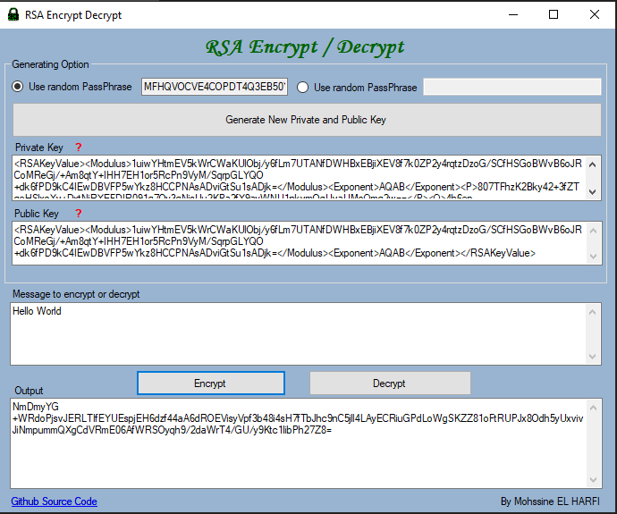

# RSA Encrypt Decrypt

Tool to encrypt and decrypt using RSA symmetric/asymmetric algorithm

This tool let you generate Private and Public Keys to Encrypt and Decrypt text using RSA Encryption.

Remember that public key is used to encrypt and should not be given to the other party,
and Private key is used to decrypt an encrypted RSA text and given to the othet party.

You can use a random passphrase with a random length between 0 and 128 characters.

If you would like only the executable here is the link to the release version:

https://github.com/melharfi/RSA-Encrypt-Decrypt/releases/download/Release/RSAencryptDecrypt.exe

This project need .Net Framework 4.5

Licensed with MIT
http://choosealicense.com/licenses/mit

Feel free to contact me for any purpose or issue you find by my address email:

m.elharfi@gmail.com

If you like the project and would like to buy me a coffee, I’ll appreciate that

Paypal account : m.elharfi@gmail.com
